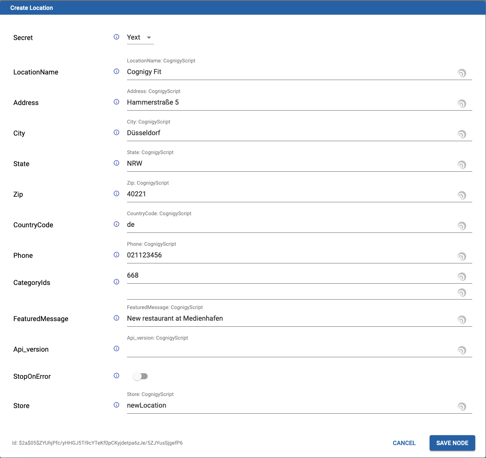

# Yext Custom Module

This Custom Module integrates [Yext.com](https://www.yext.de/) with Cognigy.

**Secrets**

- api_key
  - You need the **Knowledge API Key** from your [Yext Developer](https://developer.yext.com/) Account. There you have to create a new application and add this API to get the key.

**IMPORTANT**

You don't have to specify the **Api_version** if it doesn't matter which version you use. For default the version is `20190424`, so you can leave this field empty.


**Categories**

In Yext you use categories to sort your branches, thus you can filter your locations e.g. by the categoryId. To get all these categories, you have to GET this API Url: 

- `https://api.yext.com/v2/categories?api_key=<API_KEY>&v=20190424`

## Node: GetEntity

With this node you can get all entries of a chosen entity, such as `Locations` or `Events`, where the output will be a list of results.


## Node: GetEntityById

If you don't want to handle all results of a chosen entity, you can filter them by Id, to get only one output. Therefore you have to find out the Id. The Best way is to execute the **GetEntity** node before.


## Node: GetLocationsByFilter

Return your locations, given a chosen filter, such as the `name` or `address`. Find out more about the filter [here](https://developer.yext.com/docs/api-reference/#operation/searchLocations). 

Example Filters: 

```json
[
  {
    "city": {
      "contains": [
        {
          "$cs": {
            "script": "cc.userLocation.user_city.value",
            "type": "string"
          }
        }
      ]
    }
  }
]
```
You always need an array of filters with the syntax `[{filter}, {filter}]`, where each filter has the following syntax: 

```json
{
  "<field_name>": {
    "contains": [
      "value"
    ]
  }
}
```

The result will be a list of all found locations: 

```json
    "filteredLocations": {
        "meta": {
        "uuid": "175574c6-3786-4381-9ceb-18d6aeca809d",
        "errors": []
        },
        "response": {
        "count": 1,
        "locations": [
            {
            "id": "f1412123-ec76-4da5-957e-9dd55e457a5a",
            "uid": "EvlrGJ",
```


## Node: CreateLocation

With this node you can create a new location entity in your Yext instance, where the response will be the following:

```json
  "createdLocation": {
    "meta": {
      "uuid": "446fcd75-3614-40f7-a7c5-ef1a3c0e1736",
      "errors": []
    },
    "response": {
      "id": "f1412123-ec76-4da5-957e-9dd55e457a5a"
    }
  }
```

There are a few rules to follow, so that the node will look like this:



**Fields:**

- LocationName: 
  - The Name of your new Location
- Address: 
  - The street with house number
- City: 
  - The city of your location
- State: 
  - The state, not the country, of your location
- Zip: 
  - The exact ZIP Code of your location
- CountryCode: 
  - The code of your location's country, such as
  - en, es, de, us, ...
- Phone: 
  - The exact phone number of your location
  - **The phone number has to be a valid number!**
- CategoryIds: 
  - A list of IDs for your location
  - Look above for more information
- FeaturedMessage: 
  - A description of the new location
- API_version: 
  - **NOT REQUIRED**
  - The default version is `20190424`